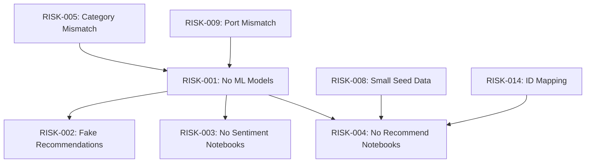

# Risk Analysis & Issues Register — EduMy

**Date**: 2026-07-30

---

## Risk Summary

| ID | Severity | Category | Title | Impact | Status |
|---|---|---|---|---|---|
| RISK-001 | 🔴 CRITICAL | ML | No trained ML models exist | All ML features return fake data | OPEN |
| RISK-002 | 🔴 CRITICAL | ML | Recommendation returns static `[1,2,3]` | "AI Recommendations" are completely fake | OPEN |
| RISK-003 | 🔴 CRITICAL | ML | Sentiment notebooks missing | Cannot reproduce training pipeline | OPEN |
| RISK-004 | 🔴 CRITICAL | ML | Recommendation notebooks missing | Cannot reproduce training pipeline | OPEN |
| RISK-005 | 🟠 HIGH | ML | Category mismatch ML vs Web | ML predictions won't map to backend categories | OPEN |
| RISK-006 | 🟠 HIGH | Security | Secrets committed in source | JWT key, Stripe keys, DB password exposed | OPEN |
| RISK-007 | 🟠 HIGH | Quality | No automated tests | Changes can break silently | OPEN |
| RISK-008 | 🟠 HIGH | Data | Seed data too small for ML | 15 enrollments insufficient for recommendation | OPEN |
| RISK-009 | 🟡 MEDIUM | Infra | Port mismatch ML service | docker-compose=8000 vs appsettings=8001 | OPEN |
| RISK-010 | 🟡 MEDIUM | UI | Hardcoded UI values in CourseDetail | Misleading stats shown to users | OPEN |
| RISK-011 | 🟡 MEDIUM | Security | MLTestController has no auth | Anyone can call test endpoints | OPEN |
| RISK-012 | 🟡 MEDIUM | Arch | No repository pattern | Controllers directly use DbContext | OPEN |
| RISK-013 | 🟡 MEDIUM | Arch | No error boundary in React | Unhandled errors crash entire app | OPEN |
| RISK-014 | 🟡 MEDIUM | ML | ID mapping: OULAD vs EduMy | External dataset IDs don't map to EduMy | OPEN |
| RISK-015 | 🟢 LOW | Infra | No .gitignore for Backend/MLService | Unnecessary files may be committed | OPEN |
| RISK-016 | 🟢 LOW | UI | CourseCreate mixes Vietnamese and English | Inconsistent UX | OPEN |
| RISK-017 | 🟢 LOW | Payment | Mock payment gateway | No real payment processing | BY_DESIGN |

---

## Detailed Risk Descriptions

### 🔴 RISK-001: No Trained ML Models Exist
**Category**: ML Core
**File(s)**: `MLService/main.py`, `edumy-ml/saved_models/`
**Description**: All 3 ML tasks (Sentiment LSTM, Classification MLP, Recommendation NCF) have NO trained model artifacts (`.keras`, `.pkl`, `.h5`). The FastAPI service uses keyword-matching heuristics that return fixed scores.
**Impact**: 
- Academic evaluation will fail: "ML model" is actually string matching
- All sentiment labels in the database are from heuristic, not from neural network
- All course classifications are from dictionary lookup, not from trained classifier
- All recommendations are hardcoded `[1,2,3]`
**Mitigation**: Train and deploy actual models. Start with Classification (most mature notebook exists).
**Effort**: HIGH (2-4 weeks for all 3 models)

---

### 🔴 RISK-002: Recommendation Returns Static [1,2,3]
**Category**: ML Core
**File**: `MLService/main.py` line 147-151
**Description**: The recommendation endpoint ignores the `user_id` parameter entirely and returns the same 3 course IDs for every user.
**Impact**:
- "AI Recommended For You" section shows same 3 courses for all students
- The "AI Match" badge is misleading — there is no AI matching
- If course IDs 1, 2, 3 don't exist, the section will be empty
**Mitigation**: Implement at minimum a popularity-based baseline before NCF.
**Effort**: MEDIUM

---

### 🔴 RISK-003 & RISK-004: Notebook Files Missing
**Category**: ML Pipeline
**File(s)**: `edumy-ml/notebooks/1-sentiment-lstm/`, `edumy-ml/notebooks/3-recommend-ncf/`
**Description**: The directories for Sentiment and Recommendation contain only `README.md` files. The 5 planned `.ipynb` notebooks listed in each README do not exist. Only the Classification notebook has an actual `.ipynb` file.
**Impact**: Cannot train, evaluate, or export models for 2 of 3 ML tasks. Training pipeline doesn't exist yet.
**Mitigation**: Create notebooks with the described structure. Consider merging into fewer notebooks for efficiency.
**Effort**: HIGH

---

### 🟠 RISK-005: Category Mismatch Between ML and Web
**Category**: Data Alignment
**File(s)**: `DataSeeder.cs` (8 categories), `notebooks/2-classify-mlp/README.md` (4 categories)
**Description**: The ML classification notebook uses Kaggle Udemy dataset with 4 categories (Development, Business, Design, Music), but the backend seeds 8 categories (Development, Business, Design, Marketing, IT & Software, Office Productivity, Personal Development, Photography).
**Impact**:
- If ML predicts "Music", no matching backend category exists
- 4 backend categories (Marketing, IT & Software, Office Productivity, Personal Development, Photography) will never be predicted by ML
- Category mapping will fail or produce incorrect assignments
**Options**:
1. Retrain with 8 categories (need augmented dataset)
2. Reduce backend to 4 categories (affects existing courses)
3. Map ML predictions to backend via a mapping table
**Recommended**: Option 3 (mapping table) as shortest path, then Option 1 for final version.

---

### 🟠 RISK-006: Secrets Committed in Source
**Category**: Security
**File(s)**: `appsettings.json`, `docker-compose.yml`
**Evidence**:
- JWT key: `"supersecretkey_minimum_32_chars_needed!!"` (line 6)
- Stripe: `"sk_test_51..."` and `"whsec_..."` (lines 12-14)
- Docker SA password: `"EduMySuperSecurePassword123!"` (line 7)
**Impact**: Anyone with repo access can decode JWT tokens, access payment provider, or connect to database.
**Mitigation**: Move to User Secrets for development, environment variables for production. Add `appsettings.*.json` to `.gitignore`.
**Effort**: LOW

---

### 🟠 RISK-007: No Automated Tests
**Category**: Quality
**Description**: Zero unit tests, integration tests, or end-to-end tests exist for any component (Backend, Frontend, MLService).
**Impact**: Any code change may break existing features without detection. ML model integration is especially risky.
**Mitigation**: Add tests for critical paths: auth flow, ML integration, review submission.
**Effort**: MEDIUM

---

### 🟠 RISK-008: Seed Data Too Small for ML Training
**Category**: Data
**File**: `DataSeeder.cs`
**Description**: Seed data creates only 15 enrollments across 10 students and 20 courses. This is insufficient for training any recommendation model.
**Impact**: Cannot use EduMy's own data for recommendation training. Must use external dataset or generate synthetic data.
**Mitigation**: Generate 50K+ synthetic interactions, or use OULAD for training with ID mapping back to EduMy.
**Effort**: MEDIUM

---

### 🟡 RISK-009: Port Mismatch for ML Service
**Category**: Infrastructure
**File(s)**: `appsettings.json:9`, `docker-compose.yml:19`
**Description**: `appsettings.json` sets ML base URL to `http://localhost:8001`, but `docker-compose.yml` exposes MLService on port 8000.
**Impact**: Local development and Docker deployment use different ports. If not careful, ML service calls will fail.
**Mitigation**: Standardize on one port. Use environment variable override for Docker.
**Effort**: LOW

---

### 🟡 RISK-010: Hardcoded UI Values in CourseDetail
**Category**: UI
**File**: `CourseDetail.jsx`
**Lines**: 180, 184, 185, 189, 320-325, 362-363
**Evidence**: `'4.7'`, `'(245,102 ratings)'`, `'890,230'`, `'Dr. Angela Yu'`, `'₫1,200,000'`, `'82% off'`, `'5 hours'`, `'65 hours'`, `'80 articles'`
**Impact**: Users see fake statistics that don't reflect actual data. Misleading but cosmetic.
**Mitigation**: Replace with real computed values or hide if no data. Add `originalPrice`, `discountPercent`, `totalDuration`, `totalArticles` fields to Course model.
**Effort**: LOW

---

### 🟡 RISK-011: MLTestController Has No Authorization
**Category**: Security
**File**: `MLTestController.cs`
**Description**: All endpoints (`/api/mltest/sentiment`, `/api/mltest/classify`, `/api/mltest/recommend`) are publicly accessible without authentication.
**Impact**: Anyone can send arbitrary text to sentiment analysis or trigger classification. Could be used for abuse or resource exhaustion.
**Mitigation**: Add `[Authorize(Roles = "Admin")]` or remove in production.
**Effort**: LOW

---

### 🟡 RISK-014: ID Mapping Between External Datasets and EduMy
**Category**: ML Integration
**Description**: If recommendation model is trained on OULAD data, the predicted item IDs are OULAD module codes. These have no correspondence to EduMy `CourseId` values (integer auto-increment).
**Impact**: Recommendation endpoint would return IDs that map to wrong/no courses.
**Resolution Options**:
1. Train on EduMy data only (too small)
2. Train on OULAD for validation metrics, then use popularity-based + content-based filtering for production
3. Use OULAD model architecture but retrain on synthetic EduMy data
**Recommended**: Option 2 for academic presentation, with clear documentation.

---

## Issue Dependency Graph

---

## Resolution Priority

| Priority | Risk IDs | Action | Estimated Effort |
|---|---|---|---|
| P0 (Before ML work) | RISK-005 | Decide on category taxonomy | 1 hour discussion |
| P0 (Before ML work) | RISK-009 | Fix port configuration | 15 minutes |
| P1 (ML Phase) | RISK-001, RISK-003 | Create + train Sentiment LSTM | 1 week |
| P1 (ML Phase) | RISK-001 | Verify + complete Classification MLP | 3 days |
| P1 (ML Phase) | RISK-001, RISK-004, RISK-008, RISK-014 | Create + train Recommendation NCF | 1-2 weeks |
| P2 (Integration) | RISK-002 | Deploy real models to FastAPI | 2-3 days |
| P3 (Polish) | RISK-006 | Move secrets to env vars | 30 minutes |
| P3 (Polish) | RISK-007 | Add critical path tests | 3 days |
| P3 (Polish) | RISK-010, RISK-011 | Fix hardcoded UI + add auth | 2 hours |
| P3 (Polish) | RISK-015, RISK-016 | Cleanup gitignore + language | 1 hour |
