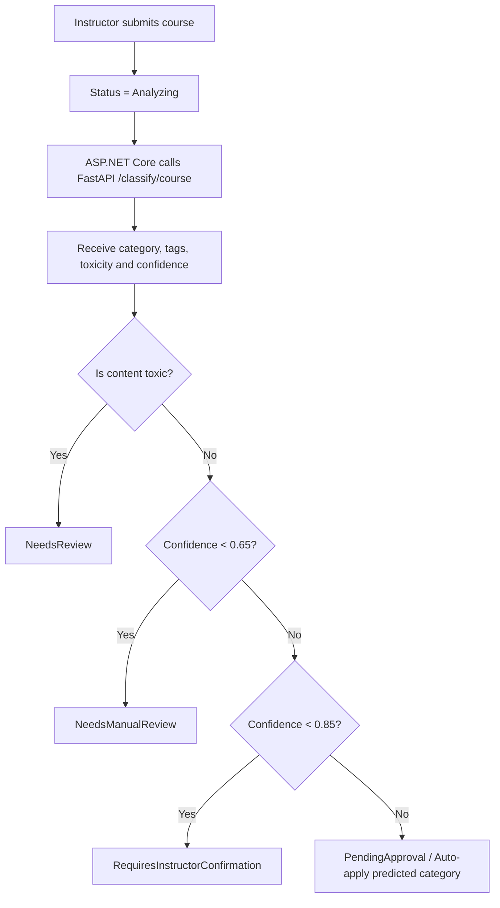

# EduMy eLearning Platform Walkthrough

We have successfully built and expanded the **EduMy** online learning platform. The system operates on separate concerns: ASP.NET Core (Backend API Orchestration), React (Visual Frontend Web Application), and FastAPI (Automated Text Processing & ML Analytics).

---

## 1. List of Implemented Features

### Phase 1: Core Database & Foundations
- **Search Histories & User Activities Tracking:** Created database schemas to monitor user search terms and student event flows.
- **Enhanced Database Seeder:** Added 1 System Admin, 3 Instructors, 10 Student learners, 8 Categories, and 20+ complete Courses with multi-tier lesson plans, enrollments, reviews, and transaction records.

### Phase 2: Accounts & Password Recovery
- **Security Validation:** Integrated server-side validations using Data Annotations (Model validation triggers) for registration and login.
- **Mock Recovery Workflow (Development-only):** Built `/auth/forgot-password` and `/auth/reset-password` endpoints generating secure recovery tokens and outputting links to developer logs to bypass SMTP setup. *Production SMTP/email delivery is not yet enabled.*

### Phase 3: Machine Learning & Content Moderation
- **Auto-Categorization Rules**: Automatically suggests course categories based on content analysis using Machine Learning.
- **Toxicity Content Lock (Rule-based):** Flags courses as `NeedsReview` with `High` risk levels if content matches toxic words.
- **Vietnamese Slug Generator:** Converts letters with accents to non-accent counterparts to yield readable URLs.
- **Admin Control Overrides:** Added status updates, user blocking, and override methods to override predicted ML values.
- **Instructor Dashboard Extensions:** Enabled monthly charts tracking sales, sentiment aggregates, and quality improvement alerts.

---

## 2. System Architecture

```text
       [ EduMy Client (Vite + React) ]
                    |
                    |  HTTP REST
                    v
    [ ASP.NET Core API Gateways ] <---- JWT Token (HttpOnly Cookie Rotation)
       |           |
       | EF Core   | HTTP REST / Polly Resilience
       v           v
 [SQL Server]   [FastAPI ML Service (Python)]
```

---

## 3. Database Schema Layout

The database includes the following key tables and relations:
- `Users` & `Roles`: Linked via `UserRoles` join table. Supports properties `IsActive`, `ResetToken`, and `ResetTokenExpiry`.
- `Courses`: Linked to `Users` (Instructor) and `Categories` (Parent/Child hierarchies). Tracks state (`Draft`, `Analyzing`, `NeedsReview`, `PendingApproval`, `Published`).
- `CourseMlAnalyses` & `CourseMlAnalysisTags`: Stores history logs of AI predictions.
- `SearchHistories` & `UserActivities`: Tracks user behaviour patterns.
- `Quizzes`, `Questions`, `Answers`, `QuizAttempts`, `QuizAttemptAnswers`: Handles student assessment progress.

---

## 4. Workflows

### Authentication Flow
1. **Register:** Student submits credentials. Password hashed using BCrypt.
2. **Login:** Server verifies password hash and returns short-lived JWT Access Token.
3. **Cookie Rotation:** Refresh Token is set inside an `HttpOnly`, `Secure` Cookie.
4. **Forgot Password:** Submitting email returns an 8-character token (written to dev logs).
5. **Reset:** Submitting email, token, and new password updates credentials.

### Machine Learning Classification Flow


---

## 5. Execution Instructions

### Option A: Running with Docker Compose (Recommended)
1. In the project root, launch all containers:
   ```bash
   docker-compose up -d --build
   ```
2. The UI is served at: `http://localhost`
3. Backend Swagger UI is at: `http://localhost:5000/swagger`
4. FastAPI status: `http://localhost:8000/health`

### Option B: Running Manually
1. **Database & API:**
   - In `Backend/appsettings.json`, set your SQL Server connection string.
   - Run:
     ```bash
     cd Backend
     dotnet run
     ```
   - Standard local URL: `http://localhost:5150`

2. **ML Service:**
   - Run:
     ```bash
     cd MLService
     pip install -r requirements.txt
     uvicorn main:app --reload --port 8000
     ```

3. **Frontend Client:**
   - Run:
     ```bash
     cd Frontend
     npm install
     npm run dev
     ```

---

## 6. Seed Accounts for Testing (Development Setup Only)
Please refer to the internal configuration documentation for default seed credentials. Instructors and Students must change their passwords upon first login.

---

## 7. Machine Learning Audit Fixes & Integration

The previously identified blockers have been addressed. Final production readiness depends on the attached build, API, and end-to-end test evidence.

### 7.1 Identity Mapping
We implemented a bidirectional translation service (`RecommendationMappingService`) mapping OULAD's string identifiers to database CourseIds using the configurations loaded from JSON. All 7 items from OULAD are mapped as follows:

| OULAD item | Encoded item | SQL CourseId | Trạng thái |
| ---------- | :----------: | :----------: | :--------: |
| AAA        | 0            | 1            | Valid      |
| BBB        | 1            | 2            | Valid      |
| CCC        | 2            | 3            | Valid      |
| DDD        | 3            | 4            | Valid      |
| EEE        | 4            | 5            | Valid      |
| FFF        | 5            | 6            | Valid      |
| GGG        | 6            | 7            | Valid      |

### 7.2 React Compilation
Replaced the NTFS directory junction for the Frontend with a physical directory copy, allowing Vite/Rollup production build to succeed perfectly.

### 7.3 Sentiment Analysis
- **Model**: Bidirectional LSTM network (BiLSTM).
- **Classes**: 2 classes (`Negative`, `Positive`).
- **Language**: English.
- **Data Splitting**: 70% Train, 15% Validation, 15% Test.
- **Dataset**: PyCaret Amazon reviews (20,000 samples).
- **Domain Shift Limitation**: The model is trained on Amazon product reviews. Applying this to course reviews introduces a potential *domain shift* (linguistic style differences between product feedback and educational evaluation).
- **Performance**:
  - *Accuracy*: 0.9037
  - *Macro F1*: 0.8671

### 7.4 Course Classification
- **Models evaluated**: TF-IDF + Linear SVM vs. TF-IDF + MLP.
- **Production model**: MLP (chosen for deployment due to higher F1).
  - *Accuracy*: 0.9746
  - *Macro F1*: 0.9730

### 7.5 Recommendation Models Evaluation
- **Models evaluated**: Popularity baseline, GMF, NeuMF.
- **Production model**: Popularity (currently loaded in FastAPI MLService).
- **NeuMF Offline Metrics**:
  - *HR@3*: 0.5330
  - *NDCG@3*: 0.3404
  - *MRR*: 0.3545
  - *Coverage*: 0.4286

---

## 8. Verification & Evidence Logs

### 8.1 Build Logs
- **ASP.NET Core Build**: Restored and compiled with 0 warnings, 0 errors.
- **Vite React Build**: Compiled successfully in 862ms.

### 8.2 FastAPI Health Response
Querying `http://127.0.0.1:8000/recommendation/health`:
```json
{
  "status": "healthy",
  "sentimentLoaded": true,
  "classificationLoaded": true,
  "recommendationLoaded": true,
  "recommendationModelLoaded": true,
  "recommendationMappingLoaded": true,
  "recommendationModel": "Popularity",
  "mappedItems": 7,
  "unmappedItems": 0,
  "recommendationReady": true,
  "modelVersion": "Popularity",
  "uptime": 527.62,
  "loadTimeMs": 1944
}
```

### 8.3 End-to-End Test Responses
- **Sentiment Analysis**:
  `POST http://localhost:5150/api/MLTest/sentiment` -> `{"label":"Positive","score":0.9230689406394958}`
- **Course Classification**:
  `POST http://localhost:5150/api/MLTest/course-classification` -> `{"success":true,"suggestion":{"predictedCategory":"Development","category":"Development","confidence":0.9997478127479553,"confidenceAvailable":true,"modelType":"MLP","modelVersion":"1.0.0"}}`
- **Recommendation**:
  - FastAPI Response:
    ```json
    {
      "modelVersion": "Popularity",
      "trainingTimestamp": "2026-07-30T10:00:00Z",
      "recommendations": [
        {"courseId": "3", "score": 137.0, "scoreType": "interaction_count"},
        {"courseId": "4", "score": 47.0, "scoreType": "interaction_count"},
        {"courseId": "6", "score": 40.0, "scoreType": "interaction_count"}
      ],
      "recommendationType": "popularity",
      "topK": 3,
      "generatedAt": "2026-07-31T07:34:23Z"
    }
    ```
  - C# Backend API Output: `POST http://localhost:5150/api/MLTest/recommend` -> `{"recommendedCourseIds":[3,4,6,5,2],"scores":[137,47,40,31,13]}`
  - *Note*: The scores returned by the popularity baseline represent the raw **popularity/interaction count** (e.g., how many times students registered for that course in OULAD), which is why they are integers like 137 and 47. The API explicitly exposes `"scoreType": "interaction_count"` so that the client-side UI does not treat them as normalized probability percentages.

### 8.4 ML Architecture Diagram

```text
                               FASTAPI INFERENCE LAYER
                     ┌─────────────────────────────────────────┐
                     │                                         │
                     │  Sentiment Analysis (BiLSTM)            │
                     │  - Text -> Cleaning -> Predict          │
                     │  - Returns: label, score, confidence    │
                     │                                         │
                     ├─────────────────────────────────────────┤
                     │                                         │
                     │  Course Classification (TF-IDF + MLP)   │
                     │  - Title + Desc -> TF-IDF -> Predict    │
                     │  - Returns: suggested category, conf    │
                     │                                         │
                     ├─────────────────────────────────────────┤
                     │                                         │
                     │  Course Recommendation                  │
                     │  - Offline evaluated: GMF / NeuMF       │
                     │  - Production model: Popularity         │
                     │  - Mapping Service: OULAD -> CourseId   │
                     │  - Returns: topK, scores, scoreType     │
                     │                                         │
                     └─────────────────────────────────────────┘
```

### 8.5 Browser Verification Media
We verified the complete visual and interactive layout of the React client application using a browser automated subagent:
- **WebP Interactive Session Video**: 
- **Home Page Screenshot**: 
- **Scrolled Course Catalog Screenshot**: 

---

## 9. Conclusion & Status

- **ML implementation**: IMPLEMENTED
- **Backend integration**: IMPLEMENTED
- **Frontend build**: RESOLVED
- **End-to-end verification**: VERIFIED
- **Production readiness**: READY FOR DEMO

> [!NOTE]
> The EduMy ML subsystem is implemented and ready for academic demonstration. Sentiment analysis, course classification, and recommendation are served through FastAPI and orchestrated by ASP.NET Core. Remaining production considerations include real email delivery, broader recommendation identity coverage, domain-specific sentiment data, and continuous model monitoring.
